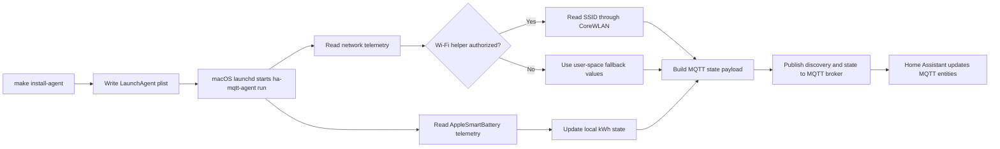

# Home Assistant MQTT Agent

## Table of Contents

- [Overview](#overview)
- [Runtime Flow](#runtime-flow)
- [Features](#features)
- [Requirements](#requirements)
- [Quick Install](#quick-install)
- [Install Modes](#install-modes)
- [Installation](#installation)
- [Configuration](#configuration)
- [Authorizing Wi-Fi SSID Access](#authorizing-wi-fi-ssid-access)
- [Usage](#usage)
- [Home Assistant Entities](#home-assistant-entities)
- [Running as a macOS Service](#running-as-a-macos-service)
- [Troubleshooting](#troubleshooting)
- [Development](#development)
- [Release Notes](#release-notes)
- [License](#license)

## Overview

`Home Assistant MQTT Agent` publishes local Mac telemetry to an MQTT broker
using Home Assistant MQTT discovery.

The current provider reads macOS AppleSmartBattery and user-space network
telemetry. It publishes current power in watts, keeps a persistent total energy
counter in kWh, and exposes battery, uptime, Wi-Fi, Ethernet, and external ping
checks as Home Assistant entities.

The default broker host is `mqtt.example.local:1883`, but every MQTT setting is
configurable so the tool can be reused with any Home Assistant setup that has
MQTT discovery enabled.

The current release is telemetry-only.

## Runtime Flow

This is the runtime path after `make install-agent` installs and starts the
per-user LaunchAgent.



## Features

- Home Assistant MQTT discovery for all sensors.
- Current power sensor with `device_class: power`, `state_class: measurement`,
  and unit `W`.
- Total energy sensor with `device_class: energy`,
  `state_class: total_increasing`, and unit `kWh`.
- Battery charge, maximum capacity, raw maximum capacity, cycle count, and
  status sensors.
- Battery temperature, battery virtual temperature, and system uptime sensors.
- Wi-Fi SSID, Wi-Fi signal in `dBm`, and Wi-Fi signal as a percentage.
- Wi-Fi BSSID, local IPv4 addresses, default gateway, gateway MAC, and a
  configurable home-network presence binary sensor.
- Optional latitude, longitude, location accuracy, and geocoded location
  sensors.
- Active wired Ethernet interface count and active interface list.
- Configurable external ping latency sensors, with Google and Cloudflare DNS
  targets enabled by default.
- Persistent local energy accumulator that survives restarts.
- Packaged command-line app exposed as `ha-mqtt-agent`.

Only macOS is supported in this release. Linux and Raspberry Pi hosts
need a future provider that does not depend on AppleSmartBattery telemetry.

## Requirements

For users:

- Python `3.11` or newer
- `make`
- Xcode Command Line Tools with `swiftc` and `codesign` for the Wi-Fi SSID
  helper
- macOS with `ioreg` for the current telemetry provider
- an MQTT broker reachable from the Mac
- Home Assistant MQTT integration with discovery enabled

For maintainers:

- `markdownlint`
- `shellcheck`
- Xcode Command Line Tools with `swiftc`

## Quick Install

Clone the repository on the Mac you want to publish, then run the installer:

```bash
git clone <repo-url>
cd ha-mqtt-agent
./scripts/install.sh
```

The script is a user-friendly wrapper around `make install-agent`. It checks the
local prerequisites, installs the standalone runtime, creates the config
template if needed, and starts the per-user LaunchAgent.

Edit the MQTT and device settings:

```bash
$EDITOR ~/.config/ha-mqtt-agent/config.toml
```

At minimum, set:

```toml
mqtt_host = "mqtt.example.local"
device_id = "workstation"
device_name = "Workstation"
```

Then restart the service:

```bash
make restart-agent
```

## Install Modes

The current supported install mode is a source install for users who can build
and locally sign the Wi-Fi helper on their Mac. There is not yet a prebuilt,
Developer ID signed, notarized installer for non-developer users.

### Current Source Install

`./scripts/install.sh` and `make install-agent` expect local build tools:

- Python `3.11` or newer for the packaged CLI runtime.
- `make` to run the project install targets.
- `swiftc` to compile the Wi-Fi SSID helper app.
- `codesign` to apply the helper's local ad-hoc signature.

The source install builds the helper during installation, then signs it with an
ad-hoc local signature. This is enough for the local Mac to run the helper and
request the macOS Location permission needed to read the current Wi-Fi SSID. It
is not a public distribution signature and does not require an Apple Developer
account.

The installer checks for these tools before installing. On macOS, `make`,
`swiftc`, and `codesign` are normally provided by Xcode Command Line Tools:

```bash
xcode-select --install
```

After installing the command line tools, rerun:

```bash
./scripts/install.sh
```

### Future Prebuilt Install

A non-developer install path is planned but not shipped yet. That path should
provide a prebuilt helper app signed with the maintainer's Developer ID
Application certificate and notarized before release. In that future mode,
users should not need `swiftc`, local helper compilation, or local signing.

The backlog item is tracked as [HMA-009](TODO.md#hma-009-prebuilt-notarized-macos-installer).

## Installation

For scripted installs, use the Make target directly:

```bash
make install-agent
```

`make install-agent`:

- builds the Wi-Fi SSID helper app from `macos/WifiHelper/`
- signs the helper locally with an ad-hoc signature and the Location entitlement
- creates a standalone virtual environment in
  `~/.local/share/ha-mqtt-agent/venv`
- installs the packaged CLI into that standalone runtime
- does not require `uv` at runtime
- links the command to `~/.local/bin/ha-mqtt-agent`
- installs a config template to `~/.config/ha-mqtt-agent/config.toml` if it
  does not exist yet
- installs and starts the per-user macOS LaunchAgent

If `~/.local/bin` is not on your `PATH`, `make check-deps` prints the shell
snippet to add it.

This installs a per-user macOS LaunchAgent named
`com.marcomc.ha-mqtt-agent`.

### Editable Development Install

```bash
make install-dev
```

This points `~/.local/bin/ha-mqtt-agent` at the project-local `.venv` so source
edits are reflected immediately.

## Configuration

The CLI reads optional config from:

- `~/.config/ha-mqtt-agent/config.toml`
- or the file passed with `--config`

Start from the example file in this repository:

- [config.toml.example](config.toml.example)
- [config.schema.json](config.schema.json)

Example:

```toml
mqtt_host = "mqtt.example.local"
mqtt_port = 1883
device_id = "workstation"
device_name = "Workstation"
sample_interval_seconds = 5
expire_after_seconds = 15
network_interval_seconds = 60
ping_timeout_seconds = 1
wifi_helper_path = "~/.local/share/ha-mqtt-agent/HaMqttAgentWifiHelper.app/Contents/MacOS/HaMqttAgentWifiHelper"
state_path = "~/.local/state/ha-mqtt-agent/state.json"
verbose = false
home_ssids = ["Home WiFi", "Home WiFi 5G"]
home_ipv4_cidrs = ["192.168.1.0/24"]
home_gateways = ["192.168.1.1"]
home_bssids = []
home_gateway_macs = []
publish_location = false
location_timeout_seconds = 3

ping_targets = [
  { id = "cloudflare_dns", host = "1.1.1.1", name = "Cloudflare DNS" },
  { id = "cloudflare_dns_secondary", host = "1.0.0.1", name = "Cloudflare DNS secondary" },
  { id = "google_dns", host = "8.8.8.8", name = "Google DNS" },
  { id = "google_dns_secondary", host = "8.8.4.4", name = "Google DNS secondary" }
]
```

`sample_interval_seconds` defaults to `5` and may be set as low as `1`.
`expire_after_seconds` defaults to `15`, so Home Assistant marks sensors
unavailable after about three missed publishes.
`network_interval_seconds` defaults to `60`; Wi-Fi, Ethernet, and ping probes
are cached between those slower network samples while the normal telemetry loop
keeps publishing. `ping_timeout_seconds` defaults to `1`.
If `mqtt_client_id` is omitted, the runtime MQTT client ID is derived from
`device_id`; one-shot publish commands add a short process suffix so they do
not disconnect the background LaunchAgent while you are debugging.

Each `ping_targets` entry creates a separate Home Assistant latency sensor named
from its `id`. To configure a longer list quickly, `ping_targets` can also be a
plain host list, for example:

```toml
ping_targets = ["192.168.1.1", "1.1.1.1", "8.8.8.8", "9.9.9.9"]
```

Home-network presence is published as a binary sensor named
`Home network present`. It turns on when any configured home SSID, BSSID, IPv4
CIDR, default gateway, or gateway MAC matches the current local network sample.
Leave lists empty to disable that specific match method.

`publish_location` defaults to `false`. Set it to `true` only when you want this
Mac to publish latitude, longitude, and horizontal accuracy to Home Assistant.
Location data uses the same macOS Location Services permission as the Wi-Fi
helper. The agent publishes both standalone latitude/longitude sensors and an
MQTT `device_tracker` named `Location` with GPS attributes, so Home Assistant
can place the Mac on map cards. If macOS temporarily reports that the location
is unknown after one valid fix has been seen, the agent keeps publishing the
last known coordinates and marks `Location cached` as on. `Location last seen`
and the `device_tracker` `last_seen` attribute show when the coordinate was last
refreshed. `Location error` shows the current CoreLocation error, if any. The
same setting also enables a `Geocoded location` sensor built from macOS reverse
geocoding, with address-style attributes such as country, locality, postal code,
street, areas of interest, and time zone. When the coordinate is cached because
CoreLocation is temporarily unavailable, the geocoded location is reused only
with that cached coordinate and is marked with `Geocoded location cached`.

On newer macOS versions, SSID access requires the macOS Location permission for
the bundled Wi-Fi helper app. Signal strength is still published from the
fallback user-space probes even before the SSID helper is authorized.

## Authorizing Wi-Fi SSID Access

macOS treats Wi-Fi SSID, BSSID, and geographic coordinates as location-adjacent
data. `make install` installs a small signed helper app at:

```text
~/.local/share/ha-mqtt-agent/HaMqttAgentWifiHelper.app
```

Run this once from the logged-in Mac session:

```bash
ha-mqtt-agent authorize-wifi
```

Approve the Location Services prompt for **Home Assistant MQTT Agent Wi-Fi
Helper**. If the prompt does not appear, open **System Settings > Privacy &
Security > Location Services** and enable that helper there, then restart the
LaunchAgent:

```bash
make restart-agent
```

Without that permission, macOS may return `<redacted>` for the SSID and omit
BSSID or location while still allowing the app to publish Wi-Fi signal strength.

For brokers with authentication, set:

```toml
mqtt_username = "homeassistant"
mqtt_password = "change-me"
```

Restart the LaunchAgent after changing the installed config:

```bash
make restart-agent
```

Changing `device_id` changes MQTT topics and Home Assistant unique IDs, so Home
Assistant will discover a new device. Remove the old MQTT device from Home
Assistant if you no longer need it.

## Usage

Inspect the resolved configuration:

```bash
ha-mqtt-agent info
```

Read one local telemetry sample without publishing:

```bash
ha-mqtt-agent sample
ha-mqtt-agent sample --json
```

Publish Home Assistant discovery and one state update:

```bash
ha-mqtt-agent publish-once
```

Run continuously:

```bash
ha-mqtt-agent run
```

## Home Assistant Entities

The discovery payloads create one Home Assistant device named by `device_name`
with these entities:

- Power: current power in `W`.
- Energy: accumulated energy in `kWh`, suitable for the Energy dashboard.
- Battery: current battery charge in `%`.
- Battery maximum capacity: reported maximum battery capacity in `%`.
- Battery maximum capacity mAh: raw maximum charge capacity in `mAh`.
- Battery design capacity: design charge capacity in `mAh`.
- Battery temperature: battery temperature in `°C`.
- Battery virtual temperature: Apple battery virtual temperature in `°C`.
- Battery cycle count.
- Battery status: `charging`, `charged`, `plugged_in`, or `discharging`.
- Uptime: system uptime in seconds.
- Wi-Fi SSID.
- Wi-Fi BSSID.
- Wi-Fi signal in `dBm`.
- Wi-Fi signal percent in `%`.
- IPv4 addresses.
- Default gateways.
- Default gateway interfaces.
- Gateway MACs.
- Home network present.
- Location device tracker for Home Assistant map cards.
- Latitude, longitude, location accuracy, last seen time, cache state, and
  location error when `publish_location` is enabled.
- Geocoded location, geocoded cache state, and geocoded error when
  `publish_location` is enabled.
- Ethernet active count.
- Ethernet active interfaces.
- One ping latency sensor in `ms` for each configured `ping_targets` entry.

The energy entity is the one to add under Home Assistant's Energy dashboard.
Home Assistant long-term statistics are fed by the `total_increasing` kWh
sensor.

Sensors use `expire_after_seconds` in MQTT discovery. The default is `15`, so
Home Assistant marks them unavailable after about three missed publishes.

CPU, GPU, memory, SSD, palm-rest, and fan sensors are not exposed by the
default LaunchAgent because macOS does not provide those detailed thermal
channels to this app without a privileged sensor source. The default publisher
stays user-scoped and does not require root.

For the complete Home Assistant setup path, including MQTT discovery checks and
Energy dashboard configuration, see
[Home Assistant Setup](docs/home-assistant-setup.md).

## Running as a macOS Service

The supported background mode is a per-user LaunchAgent, not a root
LaunchDaemon. The app reads macOS user-space battery telemetry, stores state in
the user's home directory, and does not need root privileges.

Install and start it:

```bash
make install-agent
```

Check it:

```bash
make agent-status
```

Restart it:

```bash
make restart-agent
```

Use this after editing `~/.config/ha-mqtt-agent/config.toml`; the LaunchAgent
loads config only when the process starts.

Stop and remove it:

```bash
make uninstall-agent
```

The generated plist is written to
`~/Library/LaunchAgents/com.marcomc.ha-mqtt-agent.plist`. Logs are written to
`~/Library/Logs/ha-mqtt-agent/`.

## Troubleshooting

Check the installed configuration:

```bash
ha-mqtt-agent info
```

Publish one sample manually:

```bash
ha-mqtt-agent publish-once
```

Check the background service:

```bash
make agent-status
tail -n 100 ~/Library/Logs/ha-mqtt-agent/err.log
```

Confirm that the Mac can reach the MQTT broker:

```bash
nc -vz mqtt.example.local 1883
```

If Home Assistant still shows stale values, confirm the discovery payload has
the expected `expire_after` value and restart the LaunchAgent after config
changes.

## Development

Sync the environment and run the default quality gate:

```bash
make check
```

Common commands:

```bash
make sync
make test
make lint
make run
```

Future work is tracked in [TODO.md](TODO.md) and expanded in
[Roadmap](docs/roadmap.md).

## Release Notes

Before tagging a release:

1. update the version in `pyproject.toml`
2. update `src/ha_mqtt_agent/__init__.py`
3. add release notes to `CHANGELOG.md`
4. verify `make check`

## License

This project is released under the MIT License. See [LICENSE](LICENSE).
