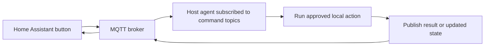
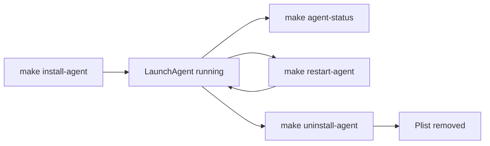

# Home Assistant MQTT Agent

## Table of Contents

- [Overview](#overview)
- [Telemetry Flow](#telemetry-flow)
- [Features](#features)
- [Requirements](#requirements)
- [Quick Install](#quick-install)
- [Installation](#installation)
- [Configuration](#configuration)
- [Usage](#usage)
- [Home Assistant Entities](#home-assistant-entities)
- [Command and Control Roadmap](#command-and-control-roadmap)
- [Running as a macOS Service](#running-as-a-macos-service)
- [Troubleshooting](#troubleshooting)
- [Project Layout](#project-layout)
- [Development](#development)
- [Release Notes](#release-notes)
- [License](#license)

## Overview

`Home Assistant MQTT Agent` publishes local host telemetry to an MQTT broker
using Home Assistant MQTT discovery.

The current provider reads macOS AppleSmartBattery telemetry, publishes current
power in watts, keeps a persistent total energy counter in kWh, and exposes
battery charge, battery maximum capacity, battery temperature, uptime, cycle
count, and charge status as Home Assistant entities. The project name is now
generic because Linux and Raspberry Pi providers are planned.

The default broker host is `mqtt.example.local:1883`, but every MQTT setting is
configurable so the tool can be reused with any Home Assistant setup that has
MQTT discovery enabled.

The current release is telemetry-only. A future command mode can let Home
Assistant expose buttons and switches for controlled host actions without opening
inbound ports on the host.

## Telemetry Flow

This diagram shows the runtime path implemented by the CLI, sensor reader,
energy accumulator, and MQTT publisher.

```mermaid
flowchart LR
  accTitle: Telemetry publishing flow
  accDescr: Shows how host telemetry becomes Home Assistant MQTT entities.
  ioreg["Read telemetry provider"] --> sample["Build telemetry sample"]
  sample --> energy["Update local kWh state"]
  energy --> payload["Build JSON state payload"]
  payload --> mqtt["Publish retained MQTT state"]
  mqtt --> discovery["Publish MQTT discovery configs"]
  discovery --> ha["Home Assistant creates device entities"]
```



## Features

- Home Assistant MQTT discovery for all sensors.
- Current power sensor with `device_class: power`, `state_class: measurement`,
  and unit `W`.
- Total energy sensor with `device_class: energy`,
  `state_class: total_increasing`, and unit `kWh`.
- Battery charge, maximum capacity, raw maximum capacity, cycle count, and
  status sensors.
- Battery temperature, battery virtual temperature, and system uptime sensors.
- Persistent local energy accumulator that survives restarts.
- Packaged command-line app exposed as `ha-mqtt-agent`.

Only macOS hosts are supported in this release. Linux and Raspberry Pi hosts
need a future provider that does not depend on AppleSmartBattery telemetry.

## Requirements

For users:

- Python `3.11` or newer
- `make`
- macOS with `ioreg` for the current telemetry provider
- an MQTT broker reachable from the host
- Home Assistant MQTT integration with discovery enabled

For maintainers:

- `markdownlint`
- `shellcheck`

## Quick Install

Clone the repository on the Mac you want to publish and run:

```bash
./scripts/install.sh
```

The script is a user-friendly wrapper around `make install-agent`. It checks the
local prerequisites, installs the standalone runtime, creates the config
template if needed, and starts the per-user LaunchAgent.

Edit the MQTT and device settings:

```bash
$EDITOR ~/.config/ha-mqtt-agent/config.toml
```

At minimum, set:

```toml
mqtt_host = "mqtt.example.local"
device_id = "workstation"
device_name = "Workstation"
```

Then restart the service:

```bash
make restart-agent
```

## Installation

Clone the repository and install the standalone runtime:

```bash
git clone <repo-url>
cd ha-mqtt-agent
make install-agent
```

`make install-agent`:

- creates a standalone virtual environment in
  `~/.local/share/ha-mqtt-agent/venv`
- installs the packaged CLI into that standalone runtime
- does not require `uv` at runtime
- links the command to `~/.local/bin/ha-mqtt-agent`
- installs a config template to `~/.config/ha-mqtt-agent/config.toml` if it
  does not exist yet
- installs and starts the per-user macOS LaunchAgent

If `~/.local/bin` is not on your `PATH`, `make check-deps` prints the shell
snippet to add it.

This installs a per-user macOS LaunchAgent named
`com.marcomc.ha-mqtt-agent`.

This diagram follows the install targets defined in `Makefile` and the
LaunchAgent installer script.

```mermaid
flowchart LR
  accTitle: Installation workflow
  accDescr: Shows how make install-agent installs the runtime and service.
  start["Run make install-agent"] --> deps["Check Python runtime"]
  deps --> venv["Create or reuse standalone venv"]
  venv --> package["Install ha-mqtt-agent package"]
  package --> link["Link CLI into ~/.local/bin"]
  link --> config["Install config template if missing"]
  config --> agent["Write LaunchAgent plist"]
  agent --> launch["Bootstrap and kickstart service"]
```



### Editable Development Install

```bash
make install-dev
```

This points `~/.local/bin/ha-mqtt-agent` at the project-local `.venv` so source
edits are reflected immediately.

## Configuration

The CLI reads optional config from:

- `~/.config/ha-mqtt-agent/config.toml`
- or the file passed with `--config`

Start from the example file in this repository:

- [config.toml.example](config.toml.example)
- [config.schema.json](config.schema.json)

Example:

```toml
mqtt_host = "mqtt.example.local"
mqtt_port = 1883
device_id = "workstation"
device_name = "Workstation"
sample_interval_seconds = 5
expire_after_seconds = 15
state_path = "~/.local/state/ha-mqtt-agent/state.json"
verbose = false
```

`sample_interval_seconds` defaults to `5` and may be set as low as `1`.
`expire_after_seconds` defaults to `15`, so Home Assistant marks sensors
unavailable after about three missed publishes.

For brokers with authentication, set:

```toml
mqtt_username = "homeassistant"
mqtt_password = "change-me"
```

Restart the LaunchAgent after changing the installed config:

```bash
make restart-agent
```

Changing `device_id` changes MQTT topics and Home Assistant unique IDs, so Home
Assistant will discover a new device. Remove the old MQTT device from Home
Assistant if you no longer need it.

## Usage

Inspect the resolved configuration:

```bash
ha-mqtt-agent info
```

Read one local telemetry sample without publishing:

```bash
ha-mqtt-agent sample
ha-mqtt-agent sample --json
```

Publish Home Assistant discovery and one state update:

```bash
ha-mqtt-agent publish-once
```

Run continuously:

```bash
ha-mqtt-agent run
```

## Home Assistant Entities

The discovery payloads create one Home Assistant device named by `device_name`
with these entities:

- Power: current power in `W`.
- Energy: accumulated energy in `kWh`, suitable for the Energy dashboard.
- Battery: current battery charge in `%`.
- Battery maximum capacity: reported maximum battery capacity in `%`.
- Battery maximum capacity mAh: raw maximum charge capacity in `mAh`.
- Battery design capacity: design charge capacity in `mAh`.
- Battery temperature: battery temperature in `°C`.
- Battery virtual temperature: Apple battery virtual temperature in `°C`.
- Battery cycle count.
- Battery status: `charging`, `charged`, `plugged_in`, or `discharging`.
- Uptime: system uptime in seconds.

The energy entity is the one to add under Home Assistant's Energy dashboard.
Home Assistant long-term statistics are fed by the `total_increasing` kWh
sensor.

Sensors use `expire_after_seconds` in MQTT discovery. The default is `15`, so
Home Assistant marks them unavailable after about three missed publishes.

CPU, GPU, memory, SSD, palm-rest, Wi-Fi, and fan sensors are not exposed by the
default LaunchAgent because macOS does not provide those detailed thermal
channels to this app without a privileged sensor source. The default publisher
stays user-scoped and does not require root.

For the complete Home Assistant setup path, including MQTT discovery checks and
Energy dashboard configuration, see
[Home Assistant Setup](docs/home-assistant-setup.md).

## Command and Control Roadmap

This project can grow from a telemetry publisher into a local host companion
service. The important design point is that MQTT does not require Home Assistant
to connect directly to the host IP address. The agent can open one outbound
connection to the MQTT broker, publish sensor state, subscribe to command topics,
and execute approved local actions when Home Assistant publishes a command.



The host still needs outbound network access to the broker. It does not need SSH,
HTTP, or any other inbound listener for MQTT command handling.

### Home Assistant Entity Model

Useful command entities should be published through MQTT discovery:

- MQTT buttons for momentary actions such as sleep display, lock screen,
  restart app, refresh telemetry, open app, or restart a named service.
- MQTT switches only when there is a real state to report, such as display
  awake or a managed background service running.
- MQTT sensors and binary sensors for command results, last command time, last
  error, active user session, display state, power assertion state, and service
  health.

Commands should use non-retained payloads so an old command is not replayed
after the agent reconnects. Discovery and normal state messages should remain
retained so Home Assistant can rebuild the device after restart.

### Privilege Model

The current LaunchAgent is the right default for user-session actions because
it runs as the logged-in user. It can access user-scoped config, publish local
telemetry, open applications, interact with user LaunchAgents, and run commands
that are allowed for that user.

Some actions need a different privilege boundary:

- User LaunchAgent: open applications, sleep the display, lock the screen,
  publish battery telemetry, restart user services, and run commands that need
  the graphical user session.
- Root LaunchDaemon: manage system daemons, perform privileged sensor reads,
  run `pmset` settings that require administrator rights, or restart protected
  services.
- Split-agent model: keep MQTT and UI actions in the user LaunchAgent, and
  expose a narrow privileged helper only for approved root actions.

Prefer the split-agent model if privileged commands are added. It keeps the
MQTT-facing process low-privilege and limits the privileged surface to explicit,
audited operations.

### Candidate Host Actions

Reasonable first commands:

- Sleep display.
- Wake display when the host is already awake.
- Lock screen.
- Start the screen saver.
- Open an allowlisted application.
- Quit or restart an allowlisted application.
- Restart the `ha-mqtt-agent` LaunchAgent.
- Refresh discovery and publish one immediate telemetry sample.
- Report command status back to Home Assistant.

Actions that need extra care:

- Full system sleep, shutdown, or reboot.
- Restarting system services.
- Running maintenance scripts.
- Changing power settings.
- Reading privileged hardware sensors.
- Any action that can interrupt active user work.

Actions to avoid:

- Executing arbitrary shell commands received from MQTT.
- Accepting command topics with wildcards from untrusted publishers.
- Retaining command payloads.
- Treating Home Assistant as proof that a command succeeded without publishing
  explicit result state from the host.

### Wake-on-LAN

Wake-on-LAN is separate from the host MQTT agent. If the host is asleep deeply
enough that the agent is not connected, MQTT cannot deliver a command to it.
Home Assistant should send the Wake-on-LAN magic packet directly on the local
network, using the host's Ethernet MAC address where possible.

Wake-on-LAN is best modeled in Home Assistant as:

- a Wake-on-LAN button to send the magic packet;
- a ping or MQTT availability sensor to show whether the host is online;
- optional MQTT buttons for actions that only work after the host is awake.

Wake-on-LAN usually depends on local network broadcast behavior, router support,
host power settings, and whether the host keeps the relevant network interface
ready during sleep. It is more reliable on wired Ethernet than on Wi-Fi.

### Security Requirements

MQTT commands are a remote-control interface for the host. Before adding them,
use these guardrails:

- Use a dedicated MQTT username for this host.
- Restrict broker ACLs so Home Assistant can publish only this host's command
  topics and the host can publish only its state and discovery topics.
- Use TLS when the broker is not fully confined to a trusted local network.
- Keep command topics under a narrow prefix such as
  `ha_mqtt_agent/<device_id>/command/<action>`.
- Implement an allowlist of named actions with fixed arguments or strict
  argument validation.
- Publish command acknowledgements, failures, and last-run timestamps.
- Log every command with action name, payload, result, and timestamp.
- Add per-command config flags so risky actions stay disabled by default.
- Treat privileged actions as a separate helper API, not as direct shell access
  from the MQTT message handler.

### What People Use This For

Home Assistant's MQTT docs explicitly support `command_topic` for buttons and
switches, and the Wake-on-LAN integration supports UI buttons for sending magic
packets. Community Mac companion projects and discussions commonly use this
pattern for volume control, display sleep, sleep/wake workflows, opening apps,
restart-style maintenance actions, and host status reporting.

Useful references:

- [Home Assistant MQTT discovery](https://www.home-assistant.io/integrations/mqtt/)
- [Home Assistant MQTT button](https://www.home-assistant.io/integrations/button.mqtt/)
- [Home Assistant Wake-on-LAN](https://www.home-assistant.io/integrations/wake_on_lan/)
- [Mac2mqtt community discussion](https://community.home-assistant.io/t/mac2mqtt-control-volume-on-macos-via-mqtt/298607)
- [Home Assistant macOS display sleep discussion](https://community.home-assistant.io/t/can-the-macos-companion-app-put-my-displays-to-sleep/417502)

## Running as a macOS Service

The supported background mode is a per-user LaunchAgent, not a root
LaunchDaemon. The app reads macOS user-space battery telemetry, stores state in
the user's home directory, and does not need root privileges.

Install and start it:

```bash
make install-agent
```

Check it:

```bash
make agent-status
```

Restart it:

```bash
make restart-agent
```

Use this after editing `~/.config/ha-mqtt-agent/config.toml`; the LaunchAgent
loads config only when the process starts.

Stop and remove it:

```bash
make uninstall-agent
```

The generated plist is written to
`~/Library/LaunchAgents/com.marcomc.ha-mqtt-agent.plist`. Logs are written to
`~/Library/Logs/ha-mqtt-agent/`.

This diagram shows the service controls exposed by the `Makefile` and backed by
the install and uninstall scripts.



## Troubleshooting

Check the installed configuration:

```bash
ha-mqtt-agent info
```

Publish one sample manually:

```bash
ha-mqtt-agent publish-once
```

Check the background service:

```bash
make agent-status
tail -n 100 ~/Library/Logs/ha-mqtt-agent/err.log
```

Confirm that the Mac can reach the MQTT broker:

```bash
nc -vz mqtt.example.local 1883
```

If Home Assistant still shows stale values, confirm the discovery payload has
the expected `expire_after` value and restart the LaunchAgent after config
changes.

## Project Layout

```text
.
├── AGENTS.md
├── CHANGELOG.md
├── Makefile
├── README.md
├── TODO.md
├── config.toml.example
├── docs/
│   ├── README.md
│   └── home-assistant-setup.md
├── pyproject.toml
├── scripts/
│   ├── install-launch-agent.sh
│   ├── install.sh
│   └── uninstall-launch-agent.sh
├── src/
│   └── ha_mqtt_agent/
│       ├── __init__.py
│       ├── __main__.py
│       ├── cli.py
│       ├── config.py
│       ├── energy.py
│       ├── mqtt.py
│       └── sensors.py
└── tests/
    ├── test_cli.py
    ├── test_energy.py
    ├── test_mqtt.py
    └── test_sensors.py
```

## Development

Sync the environment and run the default quality gate:

```bash
make check
```

Common commands:

```bash
make sync
make test
make lint
make run
```

## Release Notes

Before tagging a release:

1. update the version in `pyproject.toml`
2. update `src/ha_mqtt_agent/__init__.py`
3. add release notes to `CHANGELOG.md`
4. verify `make check`

## License

This project is released under the MIT License. See [LICENSE](LICENSE).
