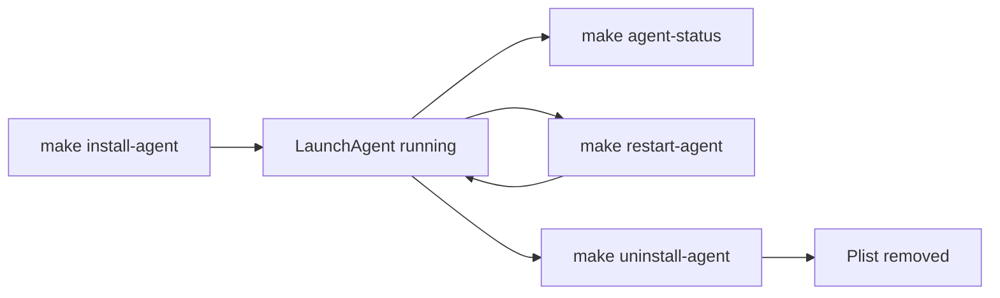

# Mac MQTT Energy

## Table of Contents

- [Overview](#overview)
- [Telemetry Flow](#telemetry-flow)
- [Features](#features)
- [Requirements](#requirements)
- [Installation](#installation)
- [Configuration](#configuration)
- [Usage](#usage)
- [Home Assistant Entities](#home-assistant-entities)
- [Running as a macOS Service](#running-as-a-macos-service)
- [Project Layout](#project-layout)
- [Development](#development)
- [Release Notes](#release-notes)
- [License](#license)

## Overview

`Mac MQTT Energy` publishes local macOS power and battery telemetry to an MQTT
broker using Home Assistant MQTT discovery.

It reads the local Mac's AppleSmartBattery telemetry, publishes current power in
watts, keeps a persistent total energy counter in kWh, and exposes battery
charge, battery maximum capacity, raw maximum capacity, cycle count, and charge
status as Home Assistant entities.

The default broker host is `mqtt.example.local:1883`, but every MQTT setting is
configurable so the tool can be reused with any Home Assistant setup that has
MQTT discovery enabled.

## Telemetry Flow

This diagram shows the runtime path implemented by the CLI, sensor reader,
energy accumulator, and MQTT publisher.


## Features

- Home Assistant MQTT discovery for all sensors.
- Current power sensor with `device_class: power`, `state_class: measurement`,
  and unit `W`.
- Total energy sensor with `device_class: energy`,
  `state_class: total_increasing`, and unit `kWh`.
- Battery charge, maximum capacity, raw maximum capacity, cycle count, and
  status sensors.
- Persistent local energy accumulator that survives restarts.
- Packaged command-line app exposed as `mac-mqtt-energy`.

## Requirements

For users:

- Python `3.11`
- `uv`
- `make`
- macOS with `ioreg`
- an MQTT broker reachable from the Mac
- Home Assistant MQTT integration with discovery enabled

For maintainers:

- `markdownlint`
- `shellcheck`

## Installation

Clone the repository and install the standalone runtime:

```bash
git clone <repo-url>
cd mac-mqtt-energy
make install
```

`make install`:

- creates a standalone virtual environment in
  `~/.local/share/mac-mqtt-energy/venv`
- installs the packaged CLI into that standalone runtime
- links the command to `~/.local/bin/mac-mqtt-energy`
- installs a config template to `~/.config/mac-mqtt-energy/config.toml` if it
  does not exist yet

If `~/.local/bin` is not on your `PATH`, `make check-deps` prints the shell
snippet to add it.

Install and start the background service:

```bash
make install-agent
```

This installs a per-user macOS LaunchAgent named
`com.marcomc.mac-mqtt-energy`.

This diagram follows the install targets defined in `Makefile` and the
LaunchAgent installer script.

```mermaid
flowchart LR
  accTitle: Installation workflow
  accDescr: Shows how make install-agent installs the runtime and service.
  start["Run make install-agent"] --> deps["Check uv, markdownlint, and shellcheck"]
  deps --> venv["Create or reuse standalone venv"]
  venv --> package["Install mac-mqtt-energy package"]
  package --> link["Link CLI into ~/.local/bin"]
  link --> config["Install config template if missing"]
  config --> agent["Write LaunchAgent plist"]
  agent --> launch["Bootstrap and kickstart service"]
```



### Editable Development Install

```bash
make install-dev
```

This points `~/.local/bin/mac-mqtt-energy` at the project-local `.venv` so source
edits are reflected immediately.

## Configuration

The CLI reads optional config from:

- `~/.config/mac-mqtt-energy/config.toml`
- or the file passed with `--config`

Start from the example file in this repository:

- [config.toml.example](config.toml.example)
- [config.schema.json](config.schema.json)

Example:

```toml
mqtt_host = "mqtt.example.local"
mqtt_port = 1883
device_id = "work_mac"
device_name = "Work Mac"
sample_interval_seconds = 30
state_path = "~/.local/state/mac-mqtt-energy/state.json"
verbose = false
```

For brokers with authentication, set:

```toml
mqtt_username = "homeassistant"
mqtt_password = "change-me"
```

Restart the LaunchAgent after changing the installed config:

```bash
make restart-agent
```

Changing `device_id` changes MQTT topics and Home Assistant unique IDs, so Home
Assistant will discover a new device. Remove the old MQTT device from Home
Assistant if you no longer need it.

## Usage

Inspect the resolved configuration:

```bash
mac-mqtt-energy info
```

Read one local telemetry sample without publishing:

```bash
mac-mqtt-energy sample
mac-mqtt-energy sample --json
```

Publish Home Assistant discovery and one state update:

```bash
mac-mqtt-energy publish-once
```

Run continuously:

```bash
mac-mqtt-energy run
```

## Home Assistant Entities

The discovery payloads create one Home Assistant device named by `device_name`
with these entities:

- Power: current power in `W`.
- Energy: accumulated energy in `kWh`, suitable for the Energy dashboard.
- Battery: current battery charge in `%`.
- Battery maximum capacity: reported maximum battery capacity in `%`.
- Battery maximum capacity mAh: raw maximum charge capacity in `mAh`.
- Battery cycle count.
- Battery status: `charging`, `charged`, `plugged_in`, or `discharging`.

The energy entity is the one to add under Home Assistant's Energy dashboard.
Home Assistant long-term statistics are fed by the `total_increasing` kWh
sensor.

For the complete Home Assistant setup path, including MQTT discovery checks and
Energy dashboard configuration, see
[Home Assistant Setup](docs/home-assistant-setup.md).

## Running as a macOS Service

The supported background mode is a per-user LaunchAgent, not a root
LaunchDaemon. The app reads macOS user-space battery telemetry, stores state in
the user's home directory, and does not need root privileges.

Install and start it:

```bash
make install-agent
```

Check it:

```bash
make agent-status
```

Restart it:

```bash
make restart-agent
```

Use this after editing `~/.config/mac-mqtt-energy/config.toml`; the LaunchAgent
loads config only when the process starts.

Stop and remove it:

```bash
make uninstall-agent
```

The generated plist is written to
`~/Library/LaunchAgents/com.marcomc.mac-mqtt-energy.plist`. Logs are written to
`~/Library/Logs/mac-mqtt-energy/`.

This diagram shows the service controls exposed by the `Makefile` and backed by
the install and uninstall scripts.



## Project Layout

```text
.
├── AGENTS.md
├── CHANGELOG.md
├── Makefile
├── README.md
├── TODO.md
├── config.toml.example
├── docs/
│   ├── README.md
│   └── home-assistant-setup.md
├── pyproject.toml
├── scripts/
│   ├── install-launch-agent.sh
│   ├── install.sh
│   └── uninstall-launch-agent.sh
├── src/
│   └── mac_mqtt_energy/
│       ├── __init__.py
│       ├── __main__.py
│       ├── cli.py
│       ├── config.py
│       ├── energy.py
│       ├── mqtt.py
│       └── sensors.py
└── tests/
    ├── test_cli.py
    ├── test_energy.py
    ├── test_mqtt.py
    └── test_sensors.py
```

## Development

Sync the environment and run the default quality gate:

```bash
make check
```

Common commands:

```bash
make sync
make test
make lint
make run
```

## Release Notes

Before tagging a release:

1. update the version in `pyproject.toml`
2. update `src/mac_mqtt_energy/__init__.py`
3. add release notes to `CHANGELOG.md`
4. verify `make check`

## License

This project is released under the MIT License. See [LICENSE](LICENSE).
