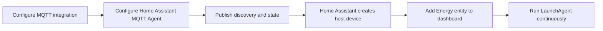

# Home Assistant Setup

## Contents

- [Overview](#overview)
- [Prerequisites](#prerequisites)
- [Step 1: Configure MQTT in Home Assistant](#step-1-configure-mqtt-in-home-assistant)
- [Step 2: Configure Home Assistant MQTT Agent](#step-2-configure-home-assistant-mqtt-agent)
- [Step 3: Publish the Device](#step-3-publish-the-device)
- [Step 4: Confirm the Device and Entities](#step-4-confirm-the-device-and-entities)
- [Step 5: Add the Host to the Energy Dashboard](#step-5-add-the-host-to-the-energy-dashboard)
- [Step 6: Run the Publisher in the Background](#step-6-run-the-publisher-in-the-background)
- [Troubleshooting](#troubleshooting)
- [References](#references)

## Overview

Home Assistant MQTT Agent publishes this host as a Home Assistant MQTT device.
Home Assistant reads retained MQTT discovery messages, creates the device, and
then uses the retained state topic for the current power, accumulated energy,
and battery sensors.



## Prerequisites

- Home Assistant is running and reachable.
- Home Assistant has the MQTT integration installed and connected to the same
  broker used by this host.
- MQTT discovery is enabled. The default discovery prefix is `homeassistant`.
- This host can reach the broker hostname and port configured in
  `~/.config/ha-mqtt-agent/config.toml`.

Set the broker host for your Home Assistant MQTT setup:

```toml
mqtt_host = "mqtt.example.local"
mqtt_port = 1883
```

## Step 1: Configure MQTT in Home Assistant

1. Open Home Assistant.
2. Go to **Settings > Devices and services**.
3. Add or open the **MQTT** integration.
4. Configure the broker host, port, username, and password expected by your
   broker.
5. Keep MQTT discovery enabled and leave the discovery prefix as
   `homeassistant` unless your broker setup uses a different prefix.

If your broker allows anonymous access, Home Assistant only needs the broker
host and port.

## Step 2: Configure Home Assistant MQTT Agent

Install the app if it is not installed yet:

```bash
cd /path/to/ha-mqtt-agent
make install
```

Edit the config file:

```bash
$EDITOR ~/.config/ha-mqtt-agent/config.toml
```

Set a stable device identity. The `device_id` becomes part of MQTT topics and
entity IDs, so do not rename it casually after Home Assistant has discovered the
device.

```toml
mqtt_host = "mqtt.example.local"
mqtt_port = 1883
discovery_prefix = "homeassistant"
topic_prefix = "ha_mqtt_agent"

device_id = "workstation"
device_name = "Workstation"

sample_interval_seconds = 5
expire_after_seconds = 15
publish_retain = true
```

`sample_interval_seconds` defaults to `5`; the minimum supported value is `1`.
`expire_after_seconds` defaults to `15`, so Home Assistant marks sensors
unavailable after about three missed publishes.

If your broker requires credentials, add:

```toml
mqtt_username = "homeassistant"
mqtt_password = "change-me"
```

Check the resolved config:

```bash
ha-mqtt-agent info
```

If the LaunchAgent is already installed, restart it after changing this file:

```bash
make restart-agent
```

Changing `device_name` updates the display name used by future discovery
payloads. Changing `device_id` is a larger change: it changes the MQTT topics
and Home Assistant unique IDs, so Home Assistant will discover a new device.
Remove the old MQTT device from Home Assistant if you no longer need it.

## Step 3: Publish the Device

Publish discovery messages and one telemetry sample:

```bash
ha-mqtt-agent publish-once
```

This publishes retained discovery messages under topics like:

```text
homeassistant/sensor/workstation_energy/config
homeassistant/sensor/workstation_power/config
homeassistant/sensor/workstation_battery/config
```

It also publishes retained state to:

```text
ha_mqtt_agent/workstation/state
```

MQTT discovery also sets `expire_after` from `expire_after_seconds`. With the
default value, Home Assistant marks the sensors unavailable after 15 seconds
without a fresh state message.

## Step 4: Confirm the Device and Entities

1. In Home Assistant, go to **Settings > Devices and services**.
2. Open the **MQTT** integration.
3. Find the device named from `device_name`, for example **Workstation**.
4. Confirm that the device has these entities:
   - `Energy`, in `kWh`
   - `Power`, in `W`
   - `Battery`, in `%`
   - `Battery maximum capacity`, in `%`
   - `Battery maximum capacity mAh`, in `mAh`
   - `Battery design capacity`, in `mAh`
   - `Battery temperature`, in `°C`
   - `Battery virtual temperature`, in `°C`
   - `Battery cycle count`
   - `Battery status`
   - `Uptime`, in seconds

Entity IDs are generated by Home Assistant from the MQTT unique IDs. With
`device_id = "workstation"`, expect names similar to:

```text
sensor.workstation_energy
sensor.workstation_power
sensor.workstation_battery
```

Home Assistant may append a suffix if an entity ID already exists.

## Step 5: Add the Host to the Energy Dashboard

The Energy dashboard needs an energy entity, not only a power entity. Use the
`Energy` entity published by this app, because it is reported in `kWh` with
`state_class: total_increasing`.

1. Go to **Settings > Dashboards > Energy**.
2. Open the individual devices section.
3. Add a device energy consumption entry.
4. Select the host energy entity, for example `sensor.workstation_energy`.
5. Save the Energy dashboard configuration.

The `Power` entity can be used for live cards and automations. The Energy
dashboard uses the `Energy` entity for long-term consumption history.

Battery temperature, maximum capacity, and uptime can be added to normal Home
Assistant dashboards. They are not Energy dashboard inputs.

## Step 6: Run the Publisher in the Background

Install and start the per-user LaunchAgent:

```bash
make install-agent
```

Check service status:

```bash
make agent-status
```

Logs are written to:

```text
~/Library/Logs/ha-mqtt-agent/out.log
~/Library/Logs/ha-mqtt-agent/err.log
```

Restart the service after config changes:

```bash
make restart-agent
```

The LaunchAgent reads `~/.config/ha-mqtt-agent/config.toml` only at process
startup, so config changes are not picked up until the service is restarted.

## Troubleshooting

### The device does not appear

- Run `ha-mqtt-agent publish-once` again.
- Confirm `discovery_prefix` matches the MQTT integration's discovery prefix.
- Confirm Home Assistant is connected to the same MQTT broker.
- In Home Assistant's MQTT integration, listen to `homeassistant/#` and confirm
  the discovery messages arrive.

### The Energy entity is not available in the Energy dashboard

- Use the `Energy` entity, not the `Power` entity.
- Confirm the entity unit is `kWh`.
- Confirm the entity has `state_class: total_increasing`.
- Wait for Home Assistant statistics to process the first samples.

### The LaunchAgent is running but publishing fails

Check the error log:

```bash
tail -n 100 ~/Library/Logs/ha-mqtt-agent/err.log
```

Then verify broker reachability from the host:

```bash
nc -vz mqtt.example.local 1883
```

Temporary broker or network failures are retried by the service loop.

### CPU, GPU, fan, or SSD temperatures are missing

The default LaunchAgent intentionally runs without root privileges. It publishes
the battery temperatures and uptime available to a user-scoped process. Deeper
thermal channels such as CPU, GPU, memory, SSD, palm-rest, Wi-Fi, and fan RPM
usually require a privileged macOS sensor source and are not published by the
default service yet.

## References

- [Home Assistant MQTT integration](https://www.home-assistant.io/integrations/mqtt/)
- [Home Assistant energy dashboard](https://www.home-assistant.io/docs/energy/)
- [Home Assistant individual device energy usage](https://www.home-assistant.io/docs/energy/individual-devices/)
