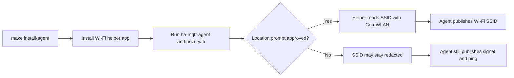

# Home Assistant Setup

## Contents

- [Overview](#overview)
- [Prerequisites](#prerequisites)
- [Step 1: Configure MQTT in Home Assistant](#step-1-configure-mqtt-in-home-assistant)
- [Step 2: Configure Home Assistant MQTT Agent](#step-2-configure-home-assistant-mqtt-agent)
- [Step 3: Publish the Device](#step-3-publish-the-device)
- [Step 4: Confirm the Device and Entities](#step-4-confirm-the-device-and-entities)
- [Step 5: Add the Mac to the Energy Dashboard](#step-5-add-the-mac-to-the-energy-dashboard)
- [Step 6: Authorize Wi-Fi SSID Access](#step-6-authorize-wi-fi-ssid-access)
- [Step 7: Run in the Background](#step-7-run-in-the-background)
- [Troubleshooting](#troubleshooting)
- [References](#references)

## Overview

Home Assistant MQTT Agent publishes this Mac as a Home Assistant MQTT device.
Home Assistant reads retained MQTT discovery messages, creates the device, and
then uses the retained state topic for the current power, accumulated energy,
and battery sensors.

For the LaunchAgent-to-MQTT runtime flow, see
[Runtime Flow](../README.md#runtime-flow).


## Prerequisites

- A Mac. Linux and Raspberry Pi hosts are not supported yet.
- Python `3.11` or newer.
- Xcode Command Line Tools with `make`, `swiftc`, and `codesign` for the
  current source install path.
- Home Assistant is running and reachable.
- Home Assistant has the MQTT integration installed and connected to the same
  broker used by this Mac.
- MQTT discovery is enabled. The default discovery prefix is `homeassistant`.
- This Mac can reach the broker hostname and port configured in
  `~/.config/ha-mqtt-agent/config.toml`.

Set the broker for your Home Assistant MQTT setup:

```toml
mqtt_host = "mqtt.example.local"
mqtt_port = 1883
```

Install Xcode Command Line Tools first if `make`, `swiftc`, or `codesign` is
missing:

```bash
xcode-select --install
```

## Step 1: Configure MQTT in Home Assistant

1. Open Home Assistant.
2. Go to **Settings > Devices and services**.
3. Add or open the **MQTT** integration.
4. Configure the broker host, port, username, and password expected by your
   broker.
5. Keep MQTT discovery enabled and leave the discovery prefix as
   `homeassistant` unless your broker setup uses a different prefix.

If your broker allows anonymous access, Home Assistant only needs the broker
hostname and port.

## Step 2: Configure Home Assistant MQTT Agent

Install the app first using the README quick install instructions.

Edit the config file:

```bash
$EDITOR ~/.config/ha-mqtt-agent/config.toml
```

Set a stable device identity. The `device_id` becomes part of MQTT topics and
entity IDs, so do not rename it casually after Home Assistant has discovered the
device.

```toml
mqtt_host = "mqtt.example.local"
mqtt_port = 1883
discovery_prefix = "homeassistant"
topic_prefix = "ha_mqtt_agent"

device_id = "workstation"
device_name = "Workstation"

sample_interval_seconds = 5
expire_after_seconds = 15
network_interval_seconds = 60
wifi_helper_path = "~/.local/share/ha-mqtt-agent/HaMqttAgentWifiHelper.app/Contents/MacOS/HaMqttAgentWifiHelper"
publish_retain = true
home_ssids = []
home_ipv4_cidrs = []
home_gateways = []
home_bssids = []
home_gateway_macs = []
publish_location = false
location_timeout_seconds = 3

ping_targets = [
  { id = "cloudflare_dns", host = "1.1.1.1", name = "Cloudflare DNS" },
  { id = "google_dns", host = "8.8.8.8", name = "Google DNS" }
]
```

`sample_interval_seconds` defaults to `5`; the minimum supported value is `1`.
`expire_after_seconds` defaults to `15`, so Home Assistant marks sensors
unavailable after about three missed publishes.
`network_interval_seconds` defaults to `60`; Wi-Fi, Ethernet, and external ping
checks are cached between these network samples. Each `ping_targets` entry gets
its own Home Assistant latency sensor. `wifi_helper_path` points to the bundled
helper app installed by `make install-agent`.

The `home_*` lists drive the `Home network present` binary sensor. It turns on
when any configured SSID, BSSID, IPv4 CIDR, gateway address, or gateway MAC
matches the current network sample. `publish_location` is off by default; enable
it only when you want latitude, longitude, and accuracy published to Home
Assistant. The agent exposes those coordinates both as standalone sensors and as
an MQTT `device_tracker` named `Location`, which is the entity type Home
Assistant map cards can display. After the first valid coordinate, temporary
CoreLocation failures do not erase the Home Assistant latitude and longitude
sensors; the agent reuses the last known coordinate and exposes
`Location cached`, `Location last seen`, `Location error`, and a
`device_tracker` `last_seen` attribute so automations can distinguish live from
cached location. The same setting publishes a `Geocoded location` sensor with
macOS reverse-geocoded address attributes such as country, locality, postal
code, street, areas of interest, and time zone. If the coordinate is cached, the
agent reuses the matching cached geocoded address and marks
`Geocoded location cached` as on.

If `mqtt_client_id` is not set, the agent derives it from `device_id`. Manual
one-shot publish commands add a process suffix, so they do not disconnect the
background LaunchAgent while you are checking MQTT discovery.

Example home-network match values:

```toml
home_ssids = ["Home WiFi", "Home WiFi 5G"]
home_ipv4_cidrs = ["192.168.1.0/24"]
home_gateways = ["192.168.1.1"]
```

If your broker requires credentials, add:

```toml
mqtt_username = "homeassistant"
mqtt_password = "change-me"
```

Check the resolved config:

```bash
ha-mqtt-agent info
```

If the LaunchAgent is already installed, restart it after changing this file:

```bash
make restart-agent
```

Changing `device_name` updates the display name used by future discovery
payloads. Changing `device_id` is a larger change: it changes the MQTT topics
and Home Assistant unique IDs, so Home Assistant will discover a new device.
Remove the old MQTT device from Home Assistant if you no longer need it.

## Step 3: Publish the Device

Publish discovery messages and one telemetry sample:

```bash
ha-mqtt-agent publish-once
```

This publishes retained discovery messages under topics like:

```text
homeassistant/sensor/workstation_energy/config
homeassistant/sensor/workstation_power/config
homeassistant/sensor/workstation_battery/config
```

It also publishes retained state to:

```text
ha_mqtt_agent/workstation/state
```

MQTT discovery sets `expire_after` from `expire_after_seconds`. With the default
value, Home Assistant marks the sensors unavailable after 15 seconds without a
fresh state message.

## Step 4: Confirm the Device and Entities

1. In Home Assistant, go to **Settings > Devices and services**.
2. Open the **MQTT** integration.
3. Find the device named from `device_name`, for example **Workstation**.
4. Confirm that the device has these entities:
   - `Energy`, in `kWh`
   - `Power`, in `W`
   - `Battery`, in `%`
   - `Battery maximum capacity`, in `%`
   - `Battery maximum capacity mAh`, in `mAh`
   - `Battery design capacity`, in `mAh`
   - `Battery temperature`, in `°C`
   - `Battery virtual temperature`, in `°C`
   - `Battery cycle count`
   - `Battery status`
   - `Uptime`, in seconds
   - `Wi-Fi SSID`
   - `Wi-Fi BSSID`
   - `Wi-Fi signal`, in `dBm`
   - `Wi-Fi signal percent`, in `%`
   - `IPv4 addresses`
   - `Default gateways`
   - `Default gateway interfaces`
   - `Gateway MACs`
   - `Home network present`
   - `Latitude`, `Longitude`, and `Location accuracy` when location publishing
     is enabled
   - `Geocoded location` when location publishing is enabled
   - `Ethernet active count`
   - `Ethernet active interfaces`
   - `Ping ...`, one latency sensor per configured ping target

Entity IDs are generated by Home Assistant from the MQTT unique IDs. With
`device_id = "workstation"`, expect names similar to:

```text
sensor.workstation_energy
sensor.workstation_power
sensor.workstation_battery
```

Home Assistant may append a suffix if an entity ID already exists.

## Step 5: Add the Mac to the Energy Dashboard

The Energy dashboard needs an energy entity, not only a power entity. Use the
`Energy` entity published by this app, because it is reported in `kWh` with
`state_class: total_increasing`.

1. Go to **Settings > Dashboards > Energy**.
2. Open the individual devices section.
3. Add a device energy consumption entry.
4. Select the Mac energy entity, for example `sensor.workstation_energy`.
5. Save the Energy dashboard configuration.

The `Power` entity can be used for live cards and automations. The Energy
dashboard uses the `Energy` entity for long-term consumption history.

Battery temperature, maximum capacity, and uptime can be added to normal Home
Assistant dashboards. They are not Energy dashboard inputs.

## Step 6: Authorize Wi-Fi SSID Access

macOS treats Wi-Fi SSID, BSSID, and geographic coordinates as location-adjacent
data. Run the
authorization helper once from the logged-in Mac session:

```bash
ha-mqtt-agent authorize-wifi
```

This grants the Location Services permission used by the installed agent's
read-only Wi-Fi helper path.



Approve the Location Services prompt for **Home Assistant MQTT Agent Wi-Fi
Helper**. If macOS does not show a prompt, open **System Settings > Privacy &
Security > Location Services**, enable that helper there, and then restart the
LaunchAgent.

Without this permission, macOS may publish the SSID as `<redacted>` and omit
BSSID or location, while signal strength and ping sensors continue to work.

## Step 7: Run in the Background

Install or restart the per-user LaunchAgent:

```bash
make install-agent
```

Check service status:

```bash
make agent-status
```

Logs are written to:

```text
~/Library/Logs/ha-mqtt-agent/out.log
~/Library/Logs/ha-mqtt-agent/err.log
```

Restart the service after config changes:

```bash
make restart-agent
```

The LaunchAgent reads `~/.config/ha-mqtt-agent/config.toml` only at process
startup, so config changes are not picked up until the service is restarted.

## Troubleshooting

### The device does not appear

- Run `ha-mqtt-agent publish-once` again.
- Confirm `discovery_prefix` matches the MQTT integration's discovery prefix.
- Confirm Home Assistant is connected to the same MQTT broker.
- In Home Assistant's MQTT integration, listen to `homeassistant/#` and confirm
  the discovery messages arrive.

### The Energy entity is not available in the Energy dashboard

- Use the `Energy` entity, not the `Power` entity.
- Confirm the entity unit is `kWh`.
- Confirm the entity has `state_class: total_increasing`.
- Wait for Home Assistant statistics to process the first samples.

### The LaunchAgent is running but publishing fails

Check the error log:

```bash
tail -n 100 ~/Library/Logs/ha-mqtt-agent/err.log
```

Then verify broker reachability from the Mac:

```bash
nc -vz mqtt.example.local 1883
```

Temporary broker or network failures are retried by the service loop.

### The device alternates between available and unavailable

- Keep `expire_after_seconds` longer than `sample_interval_seconds`.
- The default publishes every 5 seconds and expires after 15 seconds.
- Restart the LaunchAgent after changing either value.

### The install script reports missing tools

- Install Xcode Command Line Tools if `make` is missing:

  ```bash
  xcode-select --install
  ```

- Install Python 3.11 or newer if no compatible `python3.14`, `python3.13`,
  `python3.12`, `python3.11`, `uv`-managed Python, or `python3` is available.

### CPU, GPU, fan, or SSD temperatures are missing

The default LaunchAgent intentionally runs without root privileges. It publishes
the battery temperatures and uptime available to a user-scoped process. Deeper
thermal channels such as CPU, GPU, memory, SSD, palm-rest, Wi-Fi, and fan RPM
usually require a privileged macOS sensor source and are not published by the
default service yet.

## References

- [Home Assistant MQTT integration](https://www.home-assistant.io/integrations/mqtt/)
- [Home Assistant energy dashboard](https://www.home-assistant.io/docs/energy/)
- [Home Assistant individual device energy usage](https://www.home-assistant.io/docs/energy/individual-devices/)
